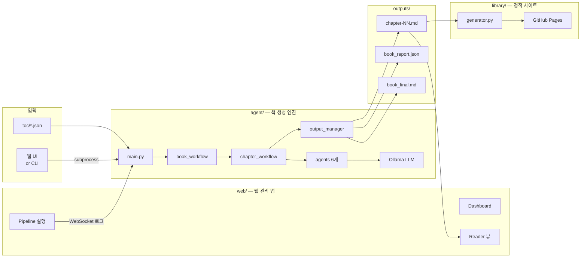

# Book Writing Agent

여러개의 AI 에이전트 서로 협력해서 책 한 권을 자동으로 써주는 시스템입니다.  
**LangGraph** + **Ollama** 기반으로 동작하며, 로컬에서 실행됩니다.

[Library: 생성된 책 모아보기](https://eunbijoel.github.io/book_agent/)


## 프로젝트 구조

```
book_agent/
├── main.py                  ← CLI 진입점 (기존과 동일하게 사용 가능)
├── publish_web.py           ← MkDocs 퍼블리셔 (선택)
│
├── agent/                   ← 책 생성 엔진
│   ├── agents/              ← 6개 AI 에이전트
│   ├── prompts/             ← 에이전트별 프롬프트
│   ├── workflows/           ← LangGraph 워크플로 + 상태 + 출력 관리
│   └── configs/             ← 모델·책 설정 (models.yaml 등)
│
├── web/                     ← 웹 관리 앱 (FastAPI)
│   ├── app.py               ← FastAPI 앱
│   ├── paths.py             ← 공유 경로 상수
│   ├── routes/              ← TOC, Pipeline, Outputs, Reader 라우트
│   ├── services/            ← Ollama 연동, 실행기, 도서관 생성, 책 스캔
│   ├── templates/           ← Jinja2 HTML 템플릿
│   └── static/              ← CSS, JavaScript
│
├── library/                 ← 정적 도서관 사이트 생성기 (GitHub Pages)
│   ├── generator.py
│   └── templates/           ← 도서관 랜딩 + 책 리더 HTML 템플릿
│
├── toc/                     ← 목차(TOC) 파일 보관
│   ├── sample-toc.json
│   └── tips-kazakhstan.json
│
├── outputs/                 ← 생성 결과물 (챕터 마크다운, 평가 JSON, 리포트)
└── tests/
```

---

## 두 가지 사용법

### 1. 웹 UI (권장)

```bash
pip install -e ".[web]"
uvicorn web.app:app --reload --port 8080
```

브라우저에서 `http://localhost:8080` 접속:


| 페이지                                   | 기능                            |
| ------------------------------------- | ----------------------------- |
| **Dashboard** `/`                     | TOC 수, 생성된 책 수, 실행 중 작업 현황    |
| **TOC 관리** `/toc/`                    | 목차 생성·수정·삭제, 챕터 동적 추가/제거      |
| **Pipeline** `/pipeline/`             | Ollama 모델 선택, TOC 선택, 책 생성 실행 |
| **작업 로그** `/pipeline/job/{id}`        | WebSocket 실시간 로그 스트리밍         |
| **Outputs** `/outputs/`               | 생성된 책 조회·삭제                   |
| **Reader** `/reader/{slug}/{chapter}` | 챕터별 읽기 뷰 (이전/다음 내비게이션)        |


### 2. CLI

```bash
# 목차 파일로 실행
python3 main.py --toc toc/tips-kazakhstan.json --model gemma4:31b

# 주제만 던져서 실행
python3 main.py --topic "주제" --lang ko --test-mode

# 백그라운드 실행
nohup python3 main.py --toc toc/tips-kazakhstan.json --model gemma4:31b \
  > outputs/run.log 2>&1 &
```

---

## Workflow




---

## 에이전트 구조

총 6개의 에이전트가 순서대로, 그리고 서로 보완하며 동작합니다.

```
[기획] → 챕터 설계 전달
         ↓
[조사] → 사실 자료 수집
         ↓
[작성] → 초고 생성
         ↓
[검토] → 문제 발견 시 [작성]으로 되돌림 (최대 2회)
         ↓
[편집] → 스타일 다듬기
         ↓
[평가] → 점수 55점 미만이면 [작성]으로 되돌림 (최대 2회)
         ↓
       챕터 완성 → 다음 챕터로
```


| 에이전트               | 역할                         | 파일                                |
| ------------------ | -------------------------- | --------------------------------- |
| **기획** (Planning)  | 챕터 순서, 목적, 핵심 개념, 톤/문체 설계  | `agent/agents/planning_agent.py`  |
| **조사** (Research)  | 챕터별 사실, 배경, 예시 수집. 환각 방지   | `agent/agents/research_agent.py`  |
| **작성** (Writing)   | 조사 결과 + 기획안 기반 초고 작성       | `agent/agents/writing_agent.py`   |
| **검토** (Reviewer)  | 사실 오류, 일관성, 누락, 반복 검토      | `agent/agents/reviewer_agent.py`  |
| **편집** (Editor)    | 문장 다듬기. 사실은 안 바꾸고 가독성만 개선  | `agent/agents/editor_agent.py`    |
| **평가** (Evaluator) | 0~100점 채점. 55점 미만 시 재작성 요청 | `agent/agents/evaluator_agent.py` |


---

## 목차 파일 형식 (TOC)

`toc/` 디렉토리에 JSON으로 저장합니다. 웹 UI에서도 생성/수정할 수 있습니다.

```json
{
  "title": "책 제목",
  "description": "책 설명",
  "language": "Korean",
  "words_per_chapter": "3000-5000",
  "writing_guidelines": [
    "구체적인 예시를 포함할 것",
    "전문 용어는 처음 등장할 때 반드시 설명할 것"
  ],
  "chapters": [
    {
      "number": 1,
      "title": "챕터 제목",
      "description": "이 챕터에서 다루는 내용"
    }
  ]
}
```

---

## CLI 옵션


| 옵션              | 기본값                                              | 설명                   |
| --------------- | ------------------------------------------------ | -------------------- |
| `--toc`         | —                                                | 목차 JSON 파일 경로        |
| `--title`       | —                                                | 책 제목 (--toc 대신 사용)   |
| `--topic`       | —                                                | 주제 (제목 자동 생성)        |
| `--description` | ""                                               | 책 설명                 |
| `--chapters`    | 5                                                | 챕터 수 (--toc 미사용 시)   |
| `--model`       | gemma4:31b                                       | Ollama 모델 이름         |
| `--base-url`    | [http://localhost:11434](http://localhost:11434) | Ollama 서버 주소         |
| `--output-dir`  | ./outputs                                        | 결과물 저장 폴더            |
| `--words`       | 3000-5000                                        | 챕터당 목표 단어 수          |
| `--lang`        | ko                                               | 작성 언어                |
| `--test-mode`   | —                                                | 짧은 챕터 (1500-2500 단어) |
| `--publish`     | —                                                | 완료 후 MkDocs 사이트 생성   |


---

## 결과물 구조

```
outputs/
└── 책-제목-슬러그/
    ├── chapter-01-챕터제목.md       ← 완성된 챕터 (YAML frontmatter 포함)
    ├── chapter-01-evaluation.json   ← 챕터별 품질 점수 상세
    ├── book_report.json             ← 책 전체 품질 리포트
    ├── .progress.json               ← 진행 상황 (중단 후 재개 가능)
    └── book-writer.log              ← 실행 로그
```

---

## 도서관 (GitHub Pages)

생성된 모든 책을 정적 HTML 사이트로 만들어 GitHub Pages에 배포합니다.

```bash
# 수동 생성
python3 library/generator.py --outputs outputs --out library_site

# 자동 배포: main 브랜치에 outputs/ 변경 push 시 GitHub Actions가 자동 빌드
```

도서관 랜딩 페이지에서 모든 책이 카드 형태로 표시되고, 클릭하면 챕터별로 읽을 수 있습니다.

---

## 설치

```bash
# 기본 (CLI만 사용)
pip install -e .

# 웹 UI 포함
pip install -e ".[web]"

# MkDocs 퍼블리셔 포함
pip install -e ".[publish]"

# 개발 (테스트)
pip install -e ".[dev]"
```

---

## 버전 히스토리


| 항목      | v1         | v2          | v3 (현재)                  |
| ------- | ---------- | ----------- | ------------------------ |
| 프레임워크   | Google ADK | LangGraph   | LangGraph                |
| 에이전트 수  | 4개 (단순 순서) | 6개 + 조건부 흐름 | 6개 + 조건부 흐름              |
| 조사 기능   | 없음         | 조사 에이전트     | 조사 에이전트                  |
| 기본 모델   | —          | qwen2.5:7b  | gemma4:31b               |
| 기본 언어   | English    | English     | Korean                   |
| 웹 UI    | 없음         | 없음          | FastAPI + Jinja2         |
| 도서관     | 없음         | MkDocs 단일 책 | 정적 HTML 멀티 책             |
| 프로젝트 구조 | 단일 폴더      | 단일 폴더       | agent / web / library 분리 |
| TOC 관리  | 수동 JSON 편집 | 수동 JSON 편집  | 웹 폼으로 생성/수정              |
| 실시간 로그  | 터미널        | 터미널         | WebSocket 스트리밍           |
| 출력물 관리  | 수동         | 수동          | 웹에서 조회/삭제                |


---

## 참고

이 프로젝트는 아래 레포지토리를 분석하고 아키텍처를 재설계하여 만들었습니다.

> **prof-lijar / orchast_agent — book-writer**  
> [https://github.com/prof-lijar/orchast_agent/tree/master/book-writer](https://github.com/prof-lijar/orchast_agent/tree/master/book-writer)

원본의 핵심 아이디어(Ollama 로컬 LLM + 순차 에이전트 파이프라인 + TOC 기반 챕터 생성)를 참고했으며, 아키텍처 전체는 LangGraph 기반으로 처음부터 새로 구현했습니다.
