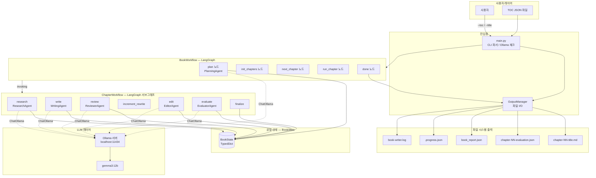

# Book Writing Agent

여러개의 AI 에이전트 서로 협력해서 책 한 권을 자동으로 써주는 시스템입니다.  
**LangGraph** + **Ollama** 기반으로 동작하며, 로컬에서 실행됩니다.

---

## Workflow:

목차(TOC) 파일 하나를 던져주면, 에이전트들이 알아서 각 챕터를 조사하고, 쓰고, 검토하고, 다듬어서 마크다운 파일로 저장합니다.  
챕터마다 품질 점수(0~100)를 매기고, 점수가 낮으면 자동으로 다시 작성합니다.





---

## 에이전트 소개

총 6개의 에이전트가 순서대로, 그리고 서로 보완하며 동작합니다.

### 1. 기획 (Planning Agent)

책 전체를 설계합니다. 챕터 순서, 각 챕터의 목적, 핵심 개념, 학습 목표, 전체 톤/문체를 정의합니다.
글을 쓰기 전에 먼저 "큰 그림"을 그리는 역할입니다.

### 2. 조사 (Research Agent)

챕터별로 필요한 사실, 배경 지식, 예시, 흔한 오해를 수집합니다.
글쓰기 에이전트가 아무 근거 없이 내용을 지어내는 것(환각)을 방지하는 역할입니다.

### 3. 작성 (Writing Agent)

조사 결과와 기획안을 바탕으로 챕터 초고를 작성합니다.
검토나 평가에서 재작성 요청이 오면 이 에이전트가 다시 씁니다.

### 4. 검토 (Reviewer Agent)

초고를 꼼꼼히 검토합니다. 확인 항목은 다음과 같습니다.

- 사실 오류나 의심스러운 주장은 없는가?
- 책 전체와 용어/논조가 일관성이 있는가?
- 다뤄야 할 핵심 개념을 빠뜨리지 않았는가?
- 불필요하게 반복되는 내용은 없는가?

심각한 문제를 발견하면 작성 에이전트에게 재작성을 요청합니다.

### 5. 편집 (Editor Agent)

검토 에이전트의 피드백을 반영해 문장을 다듬습니다. 어색한 흐름, 단조로운 문체, 어렵거나 불명확한 표현을 고칩니다. 사실이나 내용을 바꾸지 않고 오직 "읽히는 글"로 만드는 역할입니다.

### 6. 평가 (Evaluator Agent)

완성된 챕터를 0~100점으로 채점합니다.


| 평가 항목 | 비중  | 내용                |
| ----- | --- | ----------------- |
| 내용 품질 | 25% | 정확성, 깊이, 유용성      |
| 커버리지  | 20% | 학습 목표 달성도         |
| 명확성   | 20% | 독자가 이해하기 쉬운 정도    |
| 일관성   | 15% | 책 전체 용어/스타일과의 통일성 |
| 흥미도   | 10% | 읽고 싶어지는 정도        |
| 구조    | 10% | 논리적 구성과 흐름        |


점수가 55점 미만이면 자동으로 재작성을 요청합니다 (최대 2회).

---

## 에이전트들이 서로 보완하는 방식

```
[기획] → 챕터 설계 전달
         ↓
[조사] → 사실 자료 수집
         ↓
[작성] → 초고 생성
         ↓
[검토] → 문제 발견 시 [작성]으로 되돌림 (최대 2회)
         ↓
[편집] → 스타일 다듬기
         ↓
[평가] → 점수 55점 미만이면 [작성]으로 되돌림 (최대 2회)
         ↓
       챕터 완성 → 다음 챕터로
```

단순히 순서대로 실행하는 것이 아니라, 검토와 평가 결과에 따라 **흐름이 바뀝니다.**
품질이 기준에 못 미치면 다시 작성 단계로 돌아가는 피드백 루프가 있습니다.

---

## 목차 파일 형식 (TOC)

```json
{
  "title": "책 제목",
  "description": "책 설명",
  "language": "Korean",
  "words_per_chapter": "3000-5000",
  "writing_guidelines": ["구체적인 예시를 포함할 것", "전문 용어는 처음 등장할 때 반드시 설명할 것"],
  "chapters": [
    {
      "number": 1,
      "title": "챕터 제목",
      "description": "이 챕터에서 다루는 내용"
    }
  ]
}
```

---

## 실행 옵션


| 옵션              | 기본값                                              | 설명                 |
| --------------- | ------------------------------------------------ | ------------------ |
| `--toc`         | —                                                | 목차 JSON 파일 경로      |
| `--title`       | —                                                | 책 제목 (--toc 대신 사용) |
| `--description` | ""                                               | 책 설명               |
| `--chapters`    | 5                                                | 챕터 수 (--toc 미사용 시) |
| `--model`       | gemma3:12b                                       | Ollama 모델 이름       |
| `--base-url`    | [http://localhost:11434](http://localhost:11434) | Ollama 서버 주소       |
| `--output-dir`  | ./outputs                                        | 결과물 저장 폴더          |
| `--words`       | 3000-5000                                        | 챕터당 목표 단어 수        |
| `--lang`        | English                                          | 작성 언어              |


---

## 결과물 구조

```
outputs/
└── 책-제목-슬러그/
    ├── chapter-01-챕터제목.md       ← 완성된 챕터 (마크다운)
    ├── chapter-01-evaluation.json   ← 챕터별 품질 점수 상세
    ├── chapter-02-...md
    ├── book_report.json             ← 책 전체 품질 리포트
    ├── .progress.json               ← 진행 상황 (중단 후 재개 가능)
    └── book-writer.log              ← 실행 로그
```

---

## 테스트 실행

```bash
py -3 -m pytest tests/ -v
```

---

## + Updates


| 항목      | 원본 (v1)       | Current (v2)     |
| ------- | ------------- | ---------------- |
| 프레임워크   | Google ADK    | LangGraph        |
| 에이전트 수  | 4개 (단순 순서 실행) | 6개 + 조건부 흐름      |
| 조사 기능   | 없음            | 조사 에이전트          |
| 품질 기준   | 없음            | 평가 에이전트 + 재작성 루프 |
| 챕터 간 기억 | 없음            | LangGraph 상태 유지  |
| 워크플로우   | 고정 순서         | 조건부 분기 (피드백 루프)  |


---

## 참고

이 프로젝트는 아래 레포지토리를 분석하고 아키텍처를 재설계하여 만들었습니다.

> **prof-lijar / orchast_agent — book-writer**
> [https://github.com/prof-lijar/orchast_agent/tree/master/book-writer](https://github.com/prof-lijar/orchast_agent/tree/master/book-writer)

원본의 핵심 아이디어(Ollama 로컬 LLM + 순차 에이전트 파이프라인 + TOC 기반 챕터 생성)를 참고했으며, 아키텍처 전체는 LangGraph 기반으로 처음부터 새로 구현했습니다.