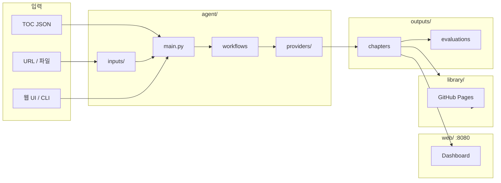

# Book Writing Agent

여러개의 AI 에이전트 서로 협력해서 책 한 권을 자동으로 써주는 시스템입니다.  
**LangGraph** 기반 Ollama / Gemini / Claude 프로바이더를 지원합니다.

[Library: 생성된 책 모아보기](https://eunbijoel.github.io/book_agent/)

브라우저: http://127.0.0.1:8080

## 프로젝트 구조

```
book_agent/
├── main.py                  ← CLI 진입점
├── experiment_runner.py     ← 모델 비교 실험 러너 (comparison.md 생성)
├── pyproject.toml           ← 패키지·의존성 설정
│
├── agent/                   ← 책 생성 엔진
│   ├── agents/              ← 6개 AI 에이전트
│   ├── prompts/             ← 에이전트별 프롬프트
│   ├── workflows/           ← LangGraph 워크플로 + 상태 + 출력 관리
│   ├── configs/             ← models.yaml
│   ├── providers/           ← Ollama / Gemini / Claude / OpenAI
│   └── inputs/              ← URL·HTML·파일·데이터 소스 추출
│
├── web/                     ← 웹 관리 앱 (FastAPI)
│   ├── app.py               ← FastAPI 앱
│   ├── paths.py             ← 공유 경로 상수
│   ├── routes/              ← Dashboard, TOC, Pipeline, Outputs, Reader
│   ├── services/            ← 프로바이더 실행, 도서관 생성, 책 스캔
│   ├── templates/           ← Jinja2 HTML 템플릿 (dashboard.html 등)
│   └── static/              ← CSS, JavaScript
│
├── library/                 ← 정적 도서관 사이트 생성기 (GitHub Pages)
│   ├── generator.py
│   └── templates/           ← 도서관 랜딩 + 책 리더 HTML 템플릿
│
├── docs/ evaluation_criteria_research.md  ← 평가 기준 리서치 (G-Eval 등)
│
├── outputs/                 ← 생성 결과물 (챕터 마크다운, 평가 JSON, 리포트)
└── tests/
```

---

## 빠른 시작

### 1. 웹 UI (권장)

```bash
pip install -e ".[web]"
uvicorn web.app:app --reload --port 8080
```

브라우저에서 `http://localhost:8080` 접속:

| 페이지                                   | 기능                            |
| ------------------------------------- | ----------------------------- |
| **Dashboard** `/`                     | TOC 수, 생성된 책 수, 실행 중 작업 현황    |
| **TOC 관리** `/toc/`                    | 목차 생성·수정·삭제, 챕터 동적 추가/제거      |
| **Pipeline** `/pipeline/`             | 프로바이더·모델·TOC 선택 후 책 생성 |
| **작업 로그** `/pipeline/job/{id}`        | WebSocket 실시간 로그         |
| **Outputs** `/outputs/`               | 생성된 책 조회·삭제                   |
| **Reader** `/reader/{slug}/{chapter}` | 챕터별 읽기     |


### 2. CLI

```bash
# 주제만으로 생성
python3 main.py --provider gemini --topic "주제" --lang ko --test-mode

# HTML/파일 소스 기반 생성
python3 main.py --provider claude \
  --input-file agent/inputs/page.html \
  --topic "반도체 AI 어시스턴트 가이드" --chapters 3 --test-mode

# TOC JSON 사용
python3 main.py --provider ollama --toc ./my-toc.json --model qwen2.5:7b
```

---

## Workflow


### Book Writing Agent 실행 페이지 


---

## 에이전트 파이프라인

```
[기획] → [조사] → [작성] → [검토] ⇄ [작성] → [편집] → [평가] ⇄ [작성] → 챕터 완료
```

| 에이전트 | 역할 | 파일 |
|----------|------|------|
| Planning | 챕터 설계, 톤·구조 | `agent/agents/planning_agent.py` |
| Research | 사실·배경 수집 | `agent/agents/research_agent.py` |
| Writing | 초고 작성 | `agent/agents/writing_agent.py` |
| Reviewer | 사실·일관성 검토 | `agent/agents/reviewer_agent.py` |
| Editor | 문체 다듬기 | `agent/agents/editor_agent.py` |
| Evaluator | 0~100점 채점, 55점 미만 재작성 | `agent/agents/evaluator_agent.py` |

---
## 평가 시스템

URL/파일 입력 시 **소스 충실도(faithfulness)** 평가가 추가됩니다.

| 구분 | 내용 |
|------|------|
| **LLM 품질** | G-Eval 스타일 6차원 (content, coherence, coverage, clarity, engagement, relevance) |
| **정량 메트릭** | 목표 단어수 비율, TTR, 5-gram 반복률 |
| **소스 충실도** | URL/파일 입력 시 — 환각·누락·핵심 포인트 커버리지 |
| **최종 점수** | LLM 70% + 정량 보정 30% |

상세 근거: `docs/evaluation_criteria_research.md`

## 모델 비교 결과

**조건:** 반도체 AI 어시스턴트 HTML 입력 · 3챕터 · 챕터당 2,000단어 목표 · 한국어 (2026-06-16)  

| 지표 | Gemini 2.5 Flash | DeepSeek-Coder-V2 | Claude Sonnet 4.6 |
|------|:----------------:|:-----------------:|:-----------------:|
| **품질 점수** | **91.2** | 80.3 | 76.7 |
| **소스 충실도** | 4.6 | **89.1** | 5.0 |
| **총 단어 수** | **8,912** | 1,117 | 2,916 |
| **목표 달성률** | 149% | 18.6% | 48.6% |
| **생성 시간** | **25.5분** | 59.5분 | 42.8분 |

**요약**

- Cloud API(Gemini, Claude)는 **글 품질은 높지만** 짧은 HTML 소스를 거의 반영하지 않음 (충실도 ~5).
- 로컬 **DeepSeek** 소스 충실도가 높았으나 **분량·속도**가 크게 부족.
- Ollama 대형 모델 3종은 **구조화 JSON·한국어 Planning**에서 실패 — 로컬은 DeepSeek-Coder-V2 실용적.
---

## 참고

이 프로젝트는 아래 레포지토리를 분석하고 아키텍처를 재설계하여 만들었습니다.

> **prof-lijar / orchast_agent — book-writer**  
> [https://github.com/prof-lijar/orchast_agent/tree/master/book-writer](https://github.com/prof-lijar/orchast_agent/tree/master/book-writer)

원본의 핵심 아이디어(Ollama 로컬 LLM + 순차 에이전트 파이프라인 + TOC 기반 챕터 생성)를 참고했으며, 아키텍처 전체는 LangGraph 기반으로 구현했습니다.
